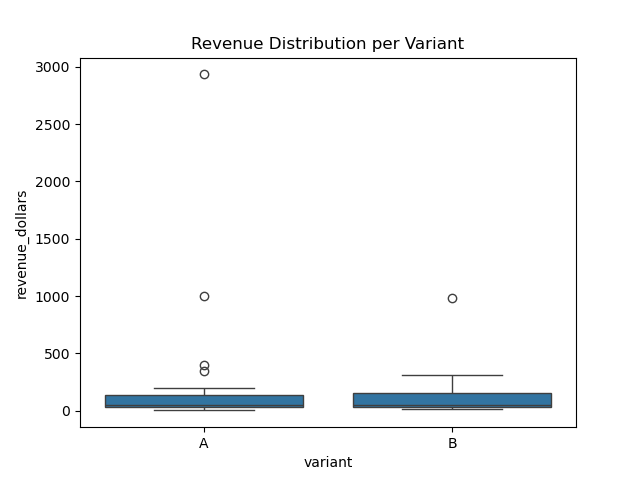

# 🧪 A/B Testing – Product Variant Impact

This project evaluates the performance difference between two website variants (A and B) using A/B testing methodology.

---

## 📊 Dataset
- Synthetic web session and transaction data (Google Analytics format)
- Columns include: `source`, `deviceCategory`, `transactions`, `transactionRevenue`, etc.

---

## 🧠 Objective
To determine whether Variant A or Variant B leads to higher:
- Conversion Rate
- Average Revenue per User

---

## 🔍 Analysis Performed
- Summary statistics and conversion rate comparison
- Revenue distribution visualized via boxplot
- Independent two-sample t-test on revenue per user

---

## 📈 Key Results
| Metric                  | Variant A | Variant B |
|-------------------------|-----------|-----------|
| Total Users             | 22        | 21        |
| Conversions             | 22        | 21        |
| **Conversion Rate**     | 100%      | 100%      |
| Total Revenue (USD)     | $5681.98  | $2622.96  |
| **Avg. Revenue/User**   | $258.27   | $124.90   |

- T-statistic: **0.929**  
- P-value: **0.3615** → Not statistically significant at 0.05 level

---

## 📊 Visualization

---

## 🛠️ Tech Stack
`Python` `pandas` `matplotlib` `seaborn` `scipy`

---

## 📁 Folder Structure
ab-testing-product-impact/
│
├── data/
│ └── google_ab_data.csv
│
├── visuals/
│ └── conversion_revenue_plot.png
│
├── notebooks/
│ └── ab_testing_analysis.ipynb
│
├── README.md
└── requirements.txt

